# Syflo

**Turn one long chat into a tree of branches.**

An AI chat app gives you one long scroll. Learning something doesn't work like
that. You need what you're reading to stay in view the whole time, and you need
somewhere to put the five questions it raised along the way.

Syflo does those two things.

- **You keep one main chat, and open a branch for every side question.** A
  branch is a separate chat, hanging off the word or the answer it came from.
  It is handed the main chat as background, so you never explain yourself
  twice — but it is *not* handed your other branches. Works in any chat, about
  anything; no document required.
- **And when there is a document, it stays visible.** Start a tree around a PDF
  or a YouTube video and it keeps the centre of the window for as long as that
  tree exists — because it belongs to the conversation, not to a message. You
  can see it, and so can the model: it never scrolls out of memory.

MIT licensed, runs entirely on your own machine.

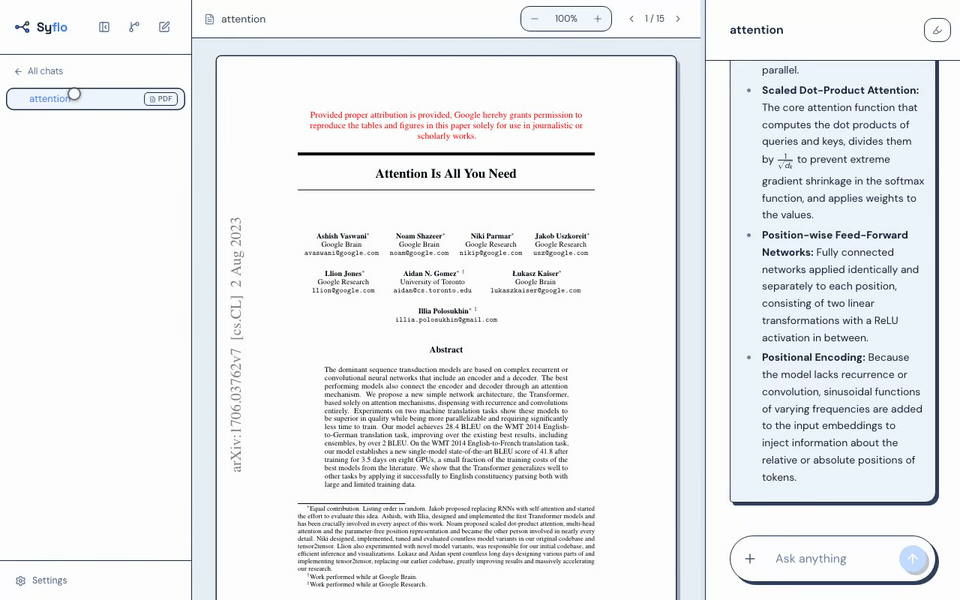

```bash
npm install -g syflo
syflo
```

Node 20+ is the only hard requirement. `syflo` starts the local backend and
opens the Syflo window; the backend listens on `127.0.0.1` only, and your chats,
uploads and API keys live in `~/.syflo` (override with `SYFLO_DATA_DIR`).

| Command | What it does |
| --- | --- |
| `syflo` | Backend + desktop window (Electron). |
| `syflo --browser` | Backend only, opens your default browser. |
| `syflo --port 4000` | Same, on another port (default 3001). |
| `syflo --help` | The flags above. |

**If the window doesn't appear**, use `syflo --browser`. The desktop window
needs Electron's binary, which is downloaded when the package is installed —
that download is the one step likely to fail behind a corporate proxy. Syflo
notices and opens the browser by itself, so the app works either way.

Ctrl-C in the terminal (or closing the window) stops the backend with it.

## You should not have to pay for this

Syflo works with Gemini, Groq, OpenAI, Anthropic and local Ollama models, and
you pick which one answers each message. Gemini and Groq both hand out free keys
with a daily allowance, and for a normal evening of reading that allowance has
been enough. When one allowance runs out, Syflo moves to the next free model by
itself and remembers not to try the exhausted one again until it resets — and it
tells you so plainly, instead of failing with a red error. The picker labels
which models are free and which cost money, so a paid one is never one misclick
away, and the free ladder never falls through to a paid model on its own.

If you want no provider at all, point Syflo at a local
[Ollama](https://ollama.com) model. Then nothing leaves your machine, and there
is nothing to pay for by definition.

The key is yours in every case: Syflo ships without one, never proxies your
traffic, and stores nothing outside `~/.syflo`
([ADR-0008](docs/adr/0008-cloud-providers-user-owned-keys.md)).

### The install also downloads one model file

`postinstall` fetches `bge-m3-q8_0.gguf`, **605 MB**, into `~/.syflo/models/`.
It is what makes long papers searchable: above roughly 97k tokens Syflo switches
to retrieval mode and picks the relevant passages itself, and those embeddings
always run on your own machine even when the answer comes from a cloud model.

```bash
# Don't download it (a metered connection, or you just don't want it):
SYFLO_SKIP_MODEL=1 npm install -g syflo
```

The download is skipped automatically when `CI` is set and in a git checkout,
and it **never fails the installation**. Without it, retrieval mode stays off
and a source too long for the context window is sent with its middle cut out
instead of searched.

---

## 1. Every question gets its own chat

Right-click a word in an answer, select a phrase, or type `/branch <topic>`. You
get a new chat dedicated to that one thing. The conversation you were in stays
exactly as it was.

Half of the benefit is that the questions now have somewhere to live: a week
later you can still find the one about attention heads, because it is its own
chat, not message 34 of 90. The other half is what the model receives. Say your tree looks like this:

```
main chat: the paper
  └── attention
        └── why several heads?      ← you are typing here
  └── GPU memory
```

Asking in *why several heads?* sends the model three things: the **attention**
chat in full, a short summary of the **main chat**, and the words you branched
on. That's it. The **GPU memory** branch is not sent — it has nothing to do with
the question ([ADR-0003](docs/adr/0003-inherited-ancestor-context.md)).

So the deeper you go, the *shorter* the context gets, not longer. Answers come
back faster, they wander off topic less often, and a free daily allowance lasts
far longer than it does in a normal chat app — a long chat re-sends its whole
history on every single message.

A panel in the child chat shows you exactly what it received.


## 2. The source stays visible

A source is optional — plenty of trees are plain conversations. But when there
*is* something to read, this is the part that changes the day-to-day.

A source is attached to the **tree**, not to a message
([ADR-0005](docs/adr/0005-one-source-per-tree-youtube-transcript.md)). Search
for a paper by name and it arrives from arXiv or OpenAlex; drop in a PDF; or
paste a YouTube link and the transcript becomes the source. It then sits in the
centre pane, and a branch four levels deep can still ask it questions. There is
no re-upload, because nothing was ever uploaded to a message.

If the source is longer than the context window, Syflo searches it and sends the
passages your question is about
([ADR-0006](docs/adr/0006-retrieval-mode-for-long-sources.md)). That search runs
locally even when the answer comes from a cloud model.


**Papers.** Read the PDF the way you'd read it on paper: select a passage,
highlight it in one of five colours, ask about it in the chat you're already in.
When the model quotes the paper, the quote is clickable — it scrolls the PDF to
that exact line and lights it up, so you can check whether the model read what
it claims to have read.

**YouTube lectures.** Paste a link and you get the transcript as the tree's
source, plus a structured overview with clickable timestamps — so you can decide
what is worth watching before you watch it. After that the transcript behaves
like the paper: select a sentence, ask what it means, branch off it. A two-hour
video becomes something you can interrogate instead of something you have to sit
through.

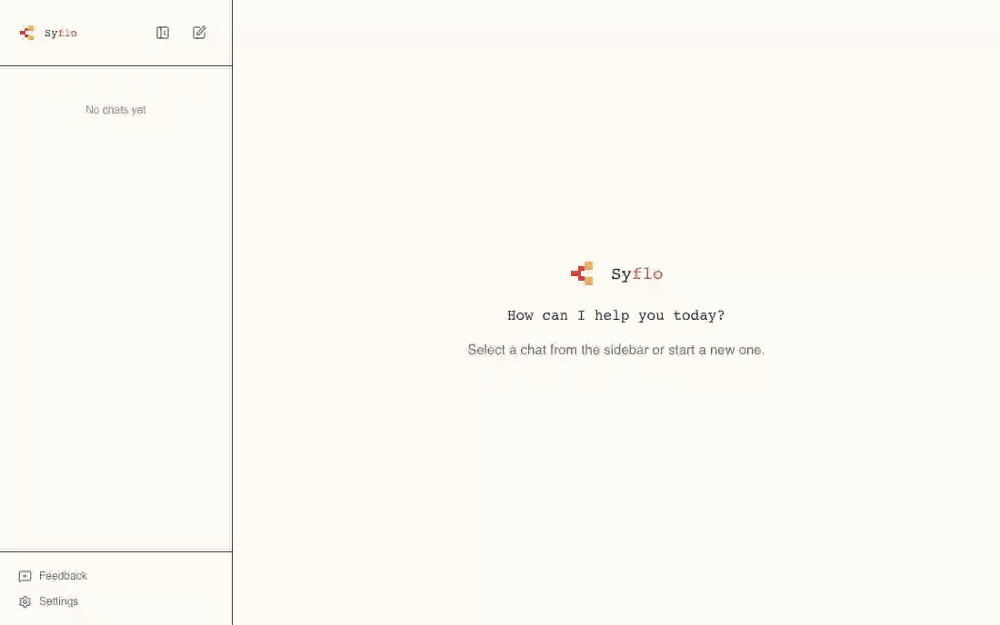

## Five themes

The default is Mushroom Kingdom — sky, clouds, question blocks. There is also a
Matrix terminal, Hyrule, and a quiet ink-on-paper theme for when you need to
look like an adult. They change more than the colours — the thinking indicator,
the app icon and the logo all follow the theme.

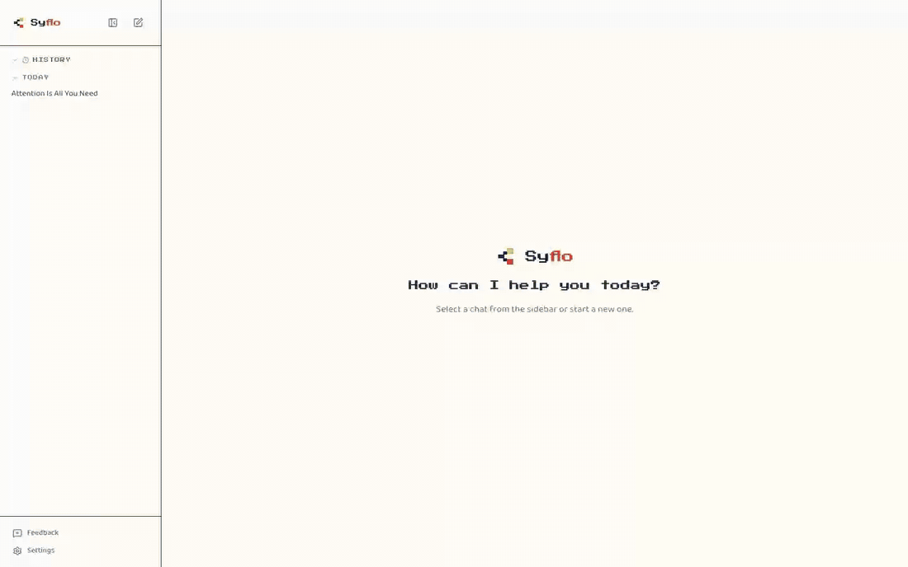

---

## The smaller things

**Definitions.** Right-click a word in an answer, or select a phrase, and a
one-line definition appears where you are looking — no new chat, no message in
the transcript.

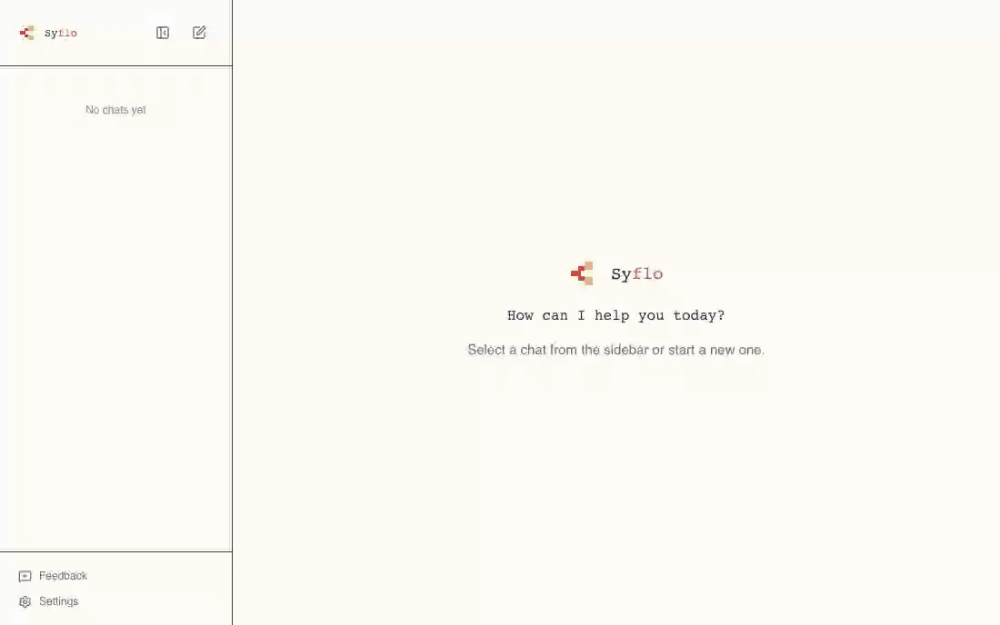

**Highlights** in five labelled colours work in the PDF, in the transcript and
in the chat. A drawer lists every mark in the tree; click one to jump back to
it, wherever it lives.


**Branch links.** Words you have branched on turn into coloured links inside the
original answer, so you can always get back to a side chat from the sentence
that started it.

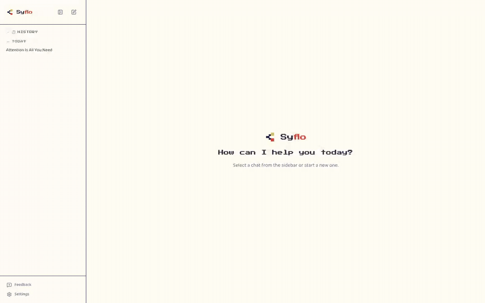

**Selection → question.** Select any passage in the PDF and either ask about it
in the chat you're in — it arrives as a quote above your question — or open it
as its own branch.

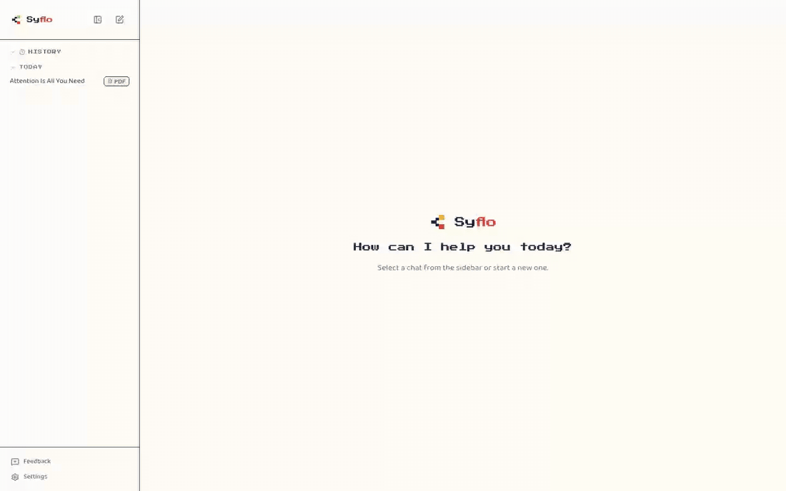

**Mind map.** The whole tree drawn top-down, root on top, with the trunk in
reserved lanes so the lines never cross. Every node is a chat: click one and you
land in it, with the conversation right below the map.

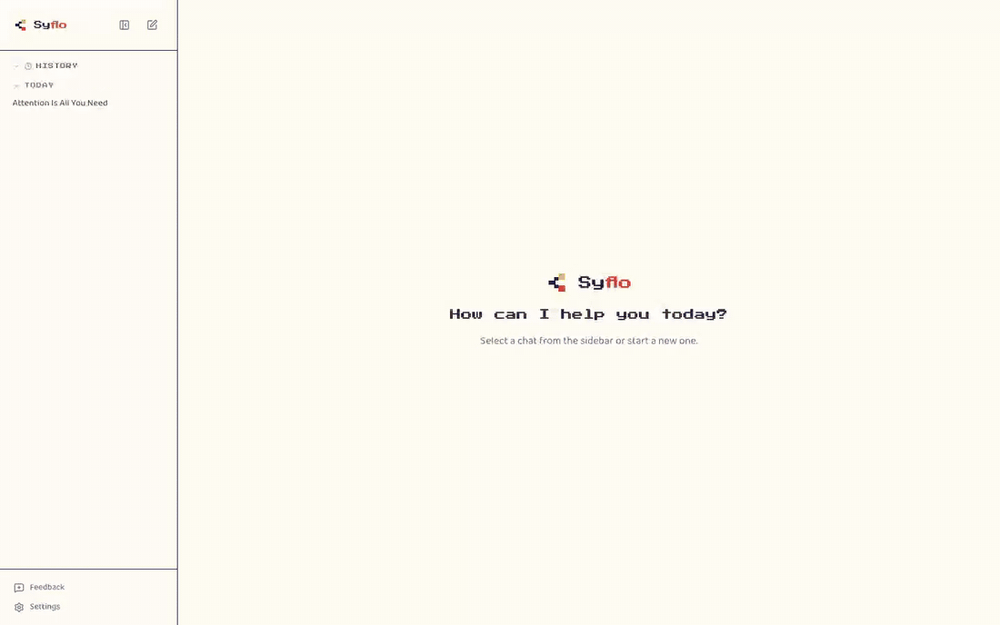

**Keyboard navigation.** Tree, highlights and composer are all reachable without
a mouse, and there is no modal "navigation mode" to enter or forget
([ADR-0011](docs/adr/0011-keyboard-navigation-without-a-mode.md)).


**`/btw` and `/branch`.** `/btw` asks a throwaway side question without
cluttering the chat; `/branch <topic>` starts a branch on something the model
never said.

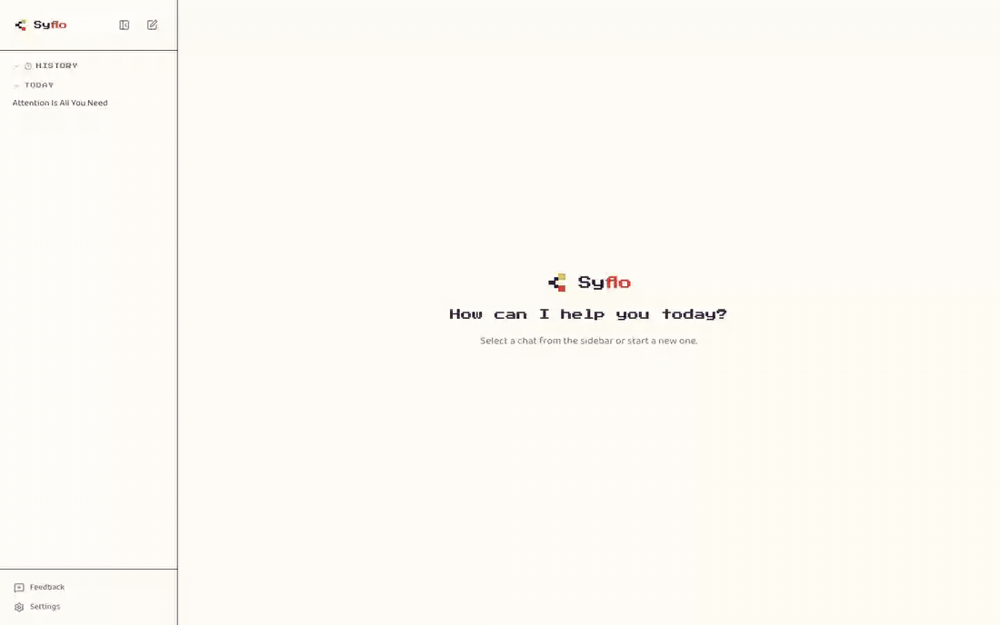

**`@aliases`.** Rename an attached screenshot to `@results` and mention it
mid-sentence, with autocomplete.

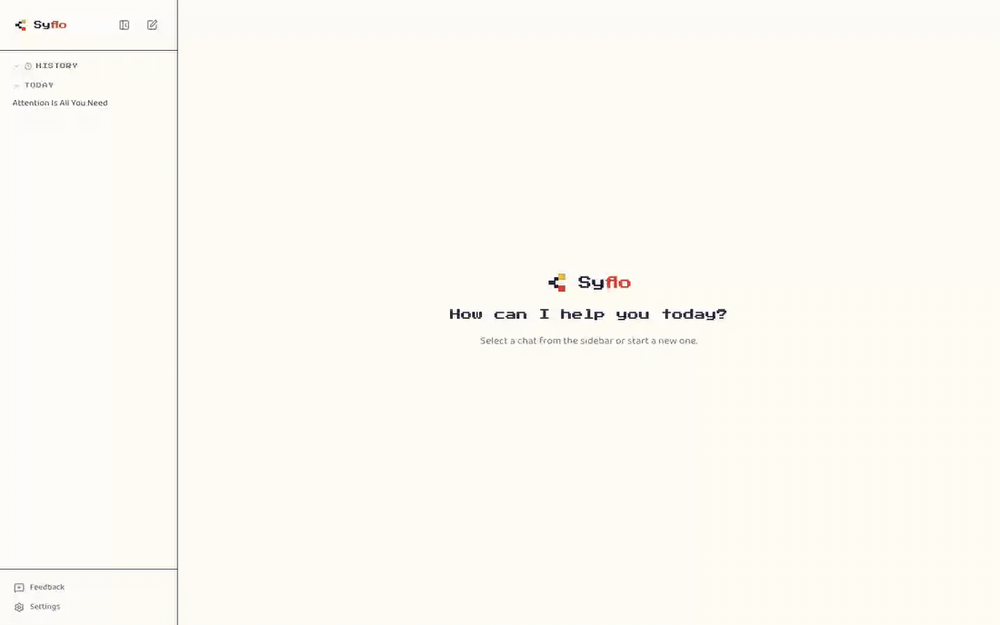

**Model picker.** Switch provider and model mid-conversation. A privacy guard
tells you whether the next message is about to leave the machine, and the picker
shows cost tiers and what is left of today's free allowance.

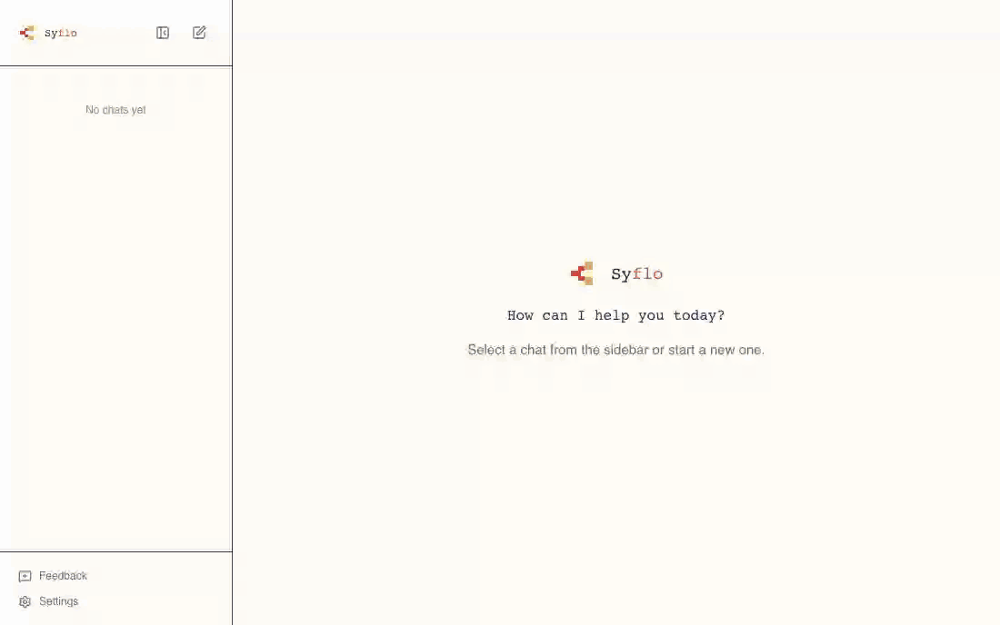

**Fully offline.** Point Syflo at Ollama and every part of the app that touches
a model runs on your machine: the answers, the search over long papers, the
titles and summaries, the dictation — and a local failure never falls back to
the cloud on its own. Syflo reads your RAM and VRAM and recommends one of three
vision models, downloadable from Settings without touching a terminal. Honest
limitation: a small local model is noticeably weaker than a frontier model on a
dense paper — local is for when a document should not leave the machine.

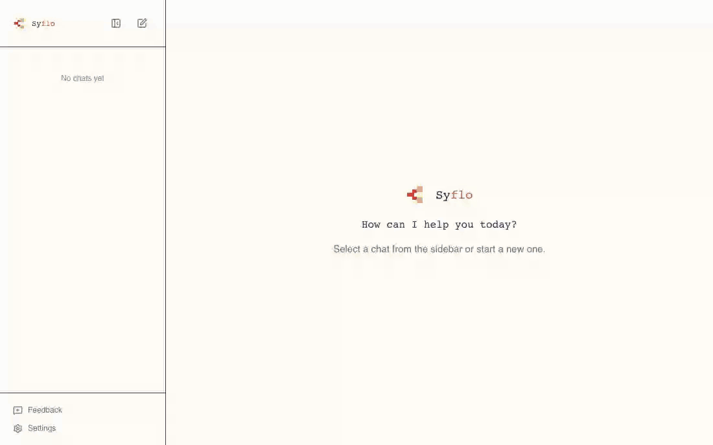

**Also in there:** streaming answers, continue-a-truncated-answer and
retry-a-failed-one without losing the thread, on-device dictation in German and
English ([ADR-0004](docs/adr/0004-on-device-whisper-dictation.md)), web search
via Tavily under your own key
([ADR-0012](docs/adr/0012-tavily-is-the-only-web-search.md)), custom
instructions, pinned chats, categories in the sidebar, KaTeX maths in answers
and titles, and an English or German interface.

---

## What to expect from this project

Syflo is a **nights-and-weekends project** maintained by one person. It is
useful daily and it is not a product: there is no roadmap, no release cadence,
and no promise that a good idea gets built. Versioning is SemVer from 0.1.0, and
1.0 waits until the SQLite schema stops moving.

- **Questions** → [Discussions](https://github.com/kavi-senewiratne/syflo/discussions)
- **Bugs and concrete feature requests** → [Issues](https://github.com/kavi-senewiratne/syflo/issues)
- **Security problems** → never a public issue; see [SECURITY.md](SECURITY.md)
- **Want to contribute?** → [CONTRIBUTING.md](CONTRIBUTING.md) and the
  [Code of Conduct](CODE_OF_CONDUCT.md)

## Prerequisites

- **Node.js 20+** — the only hard requirement.
- A provider API key (Settings → Model), *or*, for the fully local route:
  **[Ollama](https://ollama.com)** on `http://localhost:11434` with a **vision
  model** pulled, e.g. `ollama pull qwen3.5:9b` (or download it from
  Settings → Models).

## Development setup

From a clone, instead of the global install:

```bash
git clone git@github.com:kavi-senewiratne/syflo.git && cd syflo
npm install && npm --prefix backend install && npm --prefix frontend install
cp backend/.env.example backend/.env
npm --prefix backend run dev     # backend on http://localhost:3001
npm --prefix frontend run dev    # frontend on http://localhost:5173 (2nd terminal)
```

Open <http://localhost:5173> and start a new chat. A clone never triggers the
605 MB model download. There is also a `start.command` in the repo root that
boots everything together if you double-click it on macOS.

[CONTRIBUTING.md](CONTRIBUTING.md) has the rest: the Electron mirror, the house
rules for UI changes and tests, and the English-only code rule.

### Running tests

```bash
cd backend  && npm test        # Jest + Supertest
cd frontend && npm test        # vitest
cd frontend && npx tsc -b      # typecheck
npm test                       # the `syflo` CLI and the install script (repo root)
```

CI runs all four on Linux, macOS and Windows against Node 20 and 22. Both suites
must be green — and every frontend change is additionally verified in the
running app — before a change counts as done.

## Tech stack

| Layer | Stack |
| --- | --- |
| CLI | Node, `bin/syflo.js` — spawns the backend and the Electron window |
| Backend | Node.js, Express 5, SQLite (`better-sqlite3`), OpenAI SDK against each provider's compatible endpoint |
| Models | Gemini / Groq / OpenAI / Anthropic under your own key, or local Ollama; registry in `backend/registry.json` |
| Local ML | `node-llama-cpp` for bge-m3 embeddings, whisper.cpp for dictation |
| Frontend | Vite, React 19, TypeScript, Tailwind v4, React Flow, react-markdown, KaTeX, Framer Motion, Lucide |
| Desktop | Electron (window only; the backend is a separate process) |
| Tests | Vitest + Testing Library (frontend), Jest + Supertest (backend) |

## Configuration

- **Data directory**: `~/.syflo` — database, uploads and API keys. Override with
  `SYFLO_DATA_DIR`.
- **Backend port**: `--port`, or `PORT` in `backend/.env` (default 3001).
- **Embedding model**: `~/.syflo/models/bge-m3-q8_0.gguf`, fetched during
  installation. `SYFLO_SKIP_MODEL=1` skips that download,
  `SYFLO_EMBEDDING_MODEL_DIR` puts the file somewhere else.
- **Providers & models**: curated per-provider model lists (context windows,
  budget caps, vision/thinking flags, prices with an as-of date) live in
  `backend/registry.json`; the app periodically refreshes it from the repo copy
  — no user data is involved. API keys are stored in the local SQLite settings
  and are never returned to the frontend.
- **Model**: switch provider and key in Settings → Model; switch the model
  itself from the pill in the chat composer. Local Ollama models are installed
  with `ollama pull` (vision models appear in the picker).
- **Web search**: Tavily under your own key.

## Where the decisions live

- `CONTEXT.md` — the glossary of domain terms used in code and tests.
- [`docs/adr/`](docs/adr/) — the architecture decision records.
- [`docs/STYLE.md`](docs/STYLE.md) — the visual style guide: themes, tokens, and
  the recurring UI recipes.
- `article/` — the long-form write-up these sections are drawn from.

## License

MIT — see [LICENSE](LICENSE).
