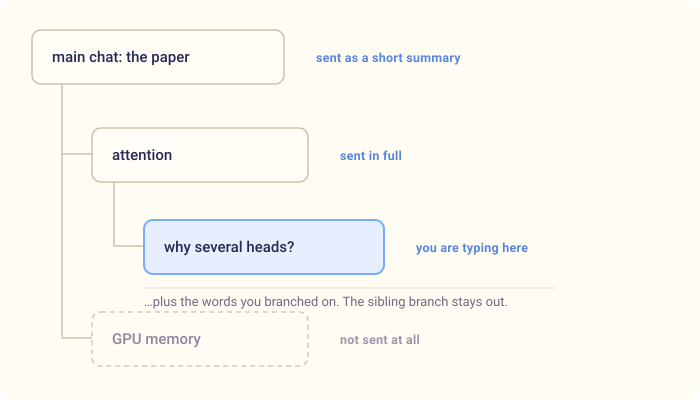

# Syflo: turn one long chat into a tree of branches

**The problem:** an AI chat app — ChatGPT, Claude, any of them — gives you one
long scroll. Learning doesn't work like that. What you're reading has to stay in
view, and the questions you've raised along the way have to stay easy to find.

Syflo does those two things.

1. **You keep one main chat, and open a branch for every side question.**
2. **The source you started from — a paper, a PDF, a video — stays visible
   however many questions you ask, so you keep the context as you dig deeper.**

It's open source.

---

## 1. Any question can get its own chat branch

A branch is created when you ask for one: right-click a word, select a phrase
in the answer or the paper, or type `/branch <topic>`.

The questions then have somewhere to live. A week later I can still find the
one about attention heads, because it is its own chat, not message 34 of 90.


*Figure 1: Select a passage and the popup offers everything at once: what it means, five colours to mark it in, a question right here, or a chat of its own.*

---

## 2. The context sent to the model stays short

The part I underestimated while building it, and the one I notice every
evening. Say my tree looks like this:



*Figure 2: In a conventional linear chat, earlier turns remain part of the context as the conversation grows. The tree sends three pieces: the parent in full, the main chat as a summary, the words branched on.*

The **GPU memory** branch is not sent at all. It has nothing to do with the
question, so the conversation you carry stays small however deep you go.

Three things follow, and I notice all three daily: faster answers, much less
wandering off topic, and a free daily allowance that lasts — a long chat carries
its whole history into every turn, and a daily quota notices.

---

## 3. The source stays visible

In Syflo a source belongs to the **tree**, not to a message. Attach it once and
it holds the centre of the window: message ninety can still ask it questions,
and so can a branch four levels deep. There is no re-upload, because nothing
was ever uploaded to a message.

### Research papers

Search for a published paper by name, or upload your own PDF. Select a passage
and highlight it in one of five colours, the way you would on physical paper —
then ask about it in the chat you're in.

The part I use most: ask about a passage and the quote stays clickable in your
own message. One click scrolls the PDF back to that line and lights it up —
three questions later I can still find what the answer was about.


*Figure 3: Search by title, import, and the paper takes the centre of the window — where it stays for the whole tree.*

### YouTube videos

Search for a video, import it, and the transcript becomes the tree's source —
plus a structured overview with clickable timestamps, so you can decide what is
worth watching before you watch it.

The transcript then behaves like the paper: select a sentence, ask what it
means, branch off it. A two-hour video becomes something you can interrogate
instead of something you have to sit through.


*Figure 4: Import a video and the overview writes its own chapters, each with a clickable timestamp into the player.*

### No attachment at all

None of this is required. Plenty of my trees have nothing attached — an
algorithm, a bug I'm thinking through — and they branch the same way. The chat
then takes the whole window, and inside a branch the centre pane shows the
parent conversation, read-only.


*Figure 5: No PDF, no video, no attachment — and the branching works exactly the same.*

---

## Models (BYOK)

Gemini, Groq, OpenAI, Anthropic, or local Ollama — your key, switchable
mid-conversation from the composer.

**It's bring-your-own-key, but you should not have to pay for this.** Gemini
and Groq both hand out free keys with a daily allowance, and a whole evening of
reading fits inside it — I have never paid for a Syflo session.

**When one allowance runs out, Syflo moves to the next free model by itself**
and remembers not to try the exhausted one again until it resets.


*Figure 6: Free models on top with what is left of today's allowance; local models at the bottom.*

---

## Try it

```bash
npm install -g syflo
syflo
```

Node 20+ is the only hard requirement. On first start, add a provider key in
Settings.

**The key stays yours.** Syflo ships without one, never proxies your
traffic, and keeps everything in `~/.syflo`. If you want no provider at all,
point it at a local [Ollama](https://ollama.com) model — then no part of your
conversation reaches a provider, and the model costs nothing.

**Repository:** <https://github.com/kavi-senewiratne/syflo>

Honest expectations: a nights-and-weekends project by one person, useful to me
daily and not a product. No roadmap, no release cadence, and the SQLite schema
still moves. Issues and pull requests are welcome; a promise that your idea gets
built is not.

---

## What it comes down to

Two ideas: a question gets somewhere to live, and the thing you are reading
doesn't disappear behind ninety messages.

Neither is something a single scrolling chat gives you, and once you have read
this way, the scroll is hard to go back to.

---

## Bonus content — the smaller things

None of these are a reason to install Syflo. They are the reasons it stays
pleasant once you have.

### One-line definitions

Right-click a word and a one-line definition appears where you are looking. No
new chat, no message in the transcript — you read it and close it again.


*Figure 7: A definition where you are looking, gone again in one click.*

### Highlights

Highlights in five labelled colours work in the PDF, the transcript **and** the
chat. A drawer lists every mark in the tree; click one to jump back, wherever it
lives.


*Figure 8: Mark the paper, mark the answer, and the drawer takes you back to either one.*

### Branch links

Words you have branched on turn into coloured links in the original answer, so
you can get back to a side chat from the sentence that started it.


*Figure 9: The branch you opened last week is still a coloured link in the sentence that caused it.*

### Asking straight from the paper

Select a passage in the PDF and you get two choices: **ask about it here**, and
it arrives as a quote above your question, or **open it as its own branch**,
which starts a chat that already knows which sentence it came from.


*Figure 10: A selection in the paper arrives as a quote above the question — or becomes a branch of its own.*

### The mind map

The whole tree as a map, root on top. Every node is a chat: click one and you
land in it, the conversation right below the map. This is how I come back to a
tree a week later.


*Figure 11: Each node carries its title and a line on what that conversation established.*

### Moving around

The whole app is reachable from the keyboard — tree, highlights, composer — with
no modal "navigation mode" to enter or forget.


*Figure 12: Arrow keys walk the tree; typing a letter puts you in the composer with that letter already there.*

### Slash commands

`/btw` asks a throwaway side question without cluttering the chat.
`/branch <topic>` starts a branch on something the model never said.


*Figure 13: A question you want answered but not kept, and a branch on a word nobody wrote.*

### Mentions

Attachments get an `@alias`. Rename a screenshot to `@results` and mention it
mid-sentence, with autocomplete — *"does the diagram in @architecture match the
numbers in @results?"*


*Figure 14: Rename an attachment once, then point at it mid-sentence like you would at a person.*

### The Mushroom Kingdom

Four themes: Mushroom Kingdom by default — sky, clouds, question blocks — plus
a Matrix terminal, Hyrule, and a plain blue one for when you need to look like
an adult.


*Figure 15: One tree, four coats of paint — logo, icon and thinking indicator included.*

### Running it fully offline

Point Syflo at [Ollama](https://ollama.com) and everything that touches a model
runs on your machine: the answers, the search over long papers, the titles and
summaries, the dictation. No key, no bill, and none of your conversation
leaving the laptop — a local failure never falls back to the cloud on its own.

Honest limitation: a small local model is noticeably weaker than Gemini on a
dense paper. I use local when I don't want a document to leave the machine,
cloud when I want the best answer.


*Figure 16: One switch in Settings and the same app runs without a key, a bill, or a network.*

*Syflo is maintained by one person in the evenings. There is no roadmap. But it
is open, and it is what I use every day.*
